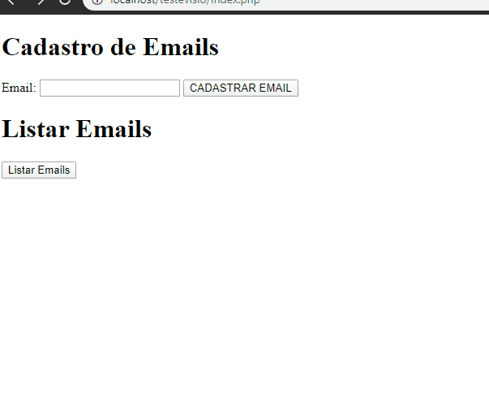

# Criando uma Newsletter em PHP

Código backend em PHP para criar uma Newsletter para captar Leads, cadastrar o email no banco MySQL, listar os emails e Exclui do banco.

# Código MySQL utilizado

      create DATABASE rafael;

      use rafael;

      create TABLE email(
          ID int AUTO_INCREMENT PRIMARY key,
          email varchar(50)    
      );

# Veja como funciona o sistema

